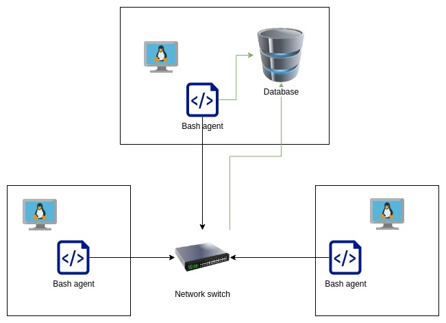

# Linux Cluster Monitoring Agent
This project is under development. Since this project follows the GitFlow, the final work will be merged to the master branch after Team Code Team.

# Introduction
The Jarvis Linux Cluster Administration (LCA) team needs to record hardware specifications and resource usage of every node on a cluster that is managed by them. On this project, an MVP was designed to meet the customer's needs. It works by execution of scripts, which retrieve hardware information and resource usage and store the information on database, so that they can be used for generating reports. The LCA team, who is the user, performs the tasks by installing the MVP, which consists of an SQL instance and a bash agent, which, upon installation, executes a script that gathers hardware specifications of the machine it is installed on, and automatically executes another script periodically that retrieve the resource usage statistics of that machine. The gathered data is then stored on a database so that it can be retrieved for reporting purposes. On this project, is bash is used for scripting, PSQL is used for interacting with the database, Docker is used for containing and running PSQL instance, and Github is used as a repository for the project.

# Quick Start
Follow these steps in order to set up and utilize the MVP properly. Navigate to the *linux_sql* folder before proceeding.
- Start a PSQL instance using *psql_docker.sh*

``
./scripts/psql_docker.sh create <psql_username> <psql_password>
``

``
./scripts/psql_docker.sh start
``

- Create tables using *ddl.sql*

``
    psql -h localhost -U postgres -d host_agent -f sql/ddl.sql
``

- Insert hardware specs data into the database using *host_info.sh*

``
    ./scripts/host_info.sh <psql_host> <psql_port> host_agent <psql_user> <psql_password>
``

- Insert hardware usage data into the database using *host_usage.sh*

``
    ./scripts/host_usage.sh <psql_host> <psql_port> host_agent <psql_user> <psql_password>
``

- Crontab setup

``
bash crontab -e
``

```
Add the following to crontab
``
* * * * * <absolute_path_to_linux_sql_project_folder>/scripts/host_usage.sh <psql_host> <psql_port> host_agent <psql_user> <psql_password> > /tmp/host_usage.log
``
```

# Implementation

## Architecture


##Scripts
- psql_docker.sh: for managing PSQL instance
- host_info.sh: for retrieving hardware information of a node
- host_usage.sh: for retrieving hardware usage of a node
- crontab: for scheduling execution of host_usage.sh
- queries.sql: for querying information by grouping hosts by hardware info and average memory usage, and also detecting host failures

##Database Modeling
- `host_info`

| id | hostname | cpu_number          | cpu_architecture           | cpu_model | cpu_mhz | L2_cache | total_mem            | timestamp |
|----|----------|---------------------|----------------------------|-----------|---------|----------|----------------------|-----------|
| Host ID (auto-increment) | Host name | Number of CPU cores | CPU architecture | CPU model | CPU frequency | L2 cache in KB | Total memory (in KB) | Current time in UTC time zone | 
- `host_usage`

| timestamp | host_id                        | memory_free         | cpu_idle                        | cpu_kernel | disk_io | disk_available |
|-----------|--------------------------------|---------------------|---------------------------------|------------|---------|----------------|
| UTC time zone | Host ID from *host_info* table | Free memory (in MB) | Time spent idle (in percentage) | Time spent running kernel code (in percentage) | Number of disk IO operations | Available disk space (in MB) |  

#Test
The bash scripts and SQL scripts were tested by executing them one at a time. The first script to be executed were *psql_docker.sh*, and accessing the PSQL instance using the terminal was performed to verify that the execution was successful. The second script to be executed was the *ddl.sql*, and verification was performed by accessing the *host_agent* database and check if tables *host_info* and *host_usage* were created properly. The third one to be executed was *host_info.sh*, and accessing the *host_info* table on the database *host_agent* and showing all entries was the method of verifying if the execution was successful. The fourth one was *host_usage.sh*, which was firstly executed manually and verified by checking the *host_info* table on the database, and then secondly executed automatically by configuring crontab, and also verified by checking the aforementioned table. The last script to be tested was *queries.sql* and it was verified by checking if the queries returned the correct information.

#Deployment
The MVP folder containing the necessary script files is hosted on a Github repository. It needs to be cloned/downloaded to each of the node on the cluster. One node hosts the database via Docker. As for the scheduler for retrieving hardware usage, crontab configuration needs to be performed on each node.

#Improvements
It would be nice to improve or add the following:
- A script that runs the entire set up by calling other scripts..
- A script that allows users to set up crontab just by inputting the cron values.
- A table that informs LCA team on what actions that are suggested in case of low memory or disk space on each node.